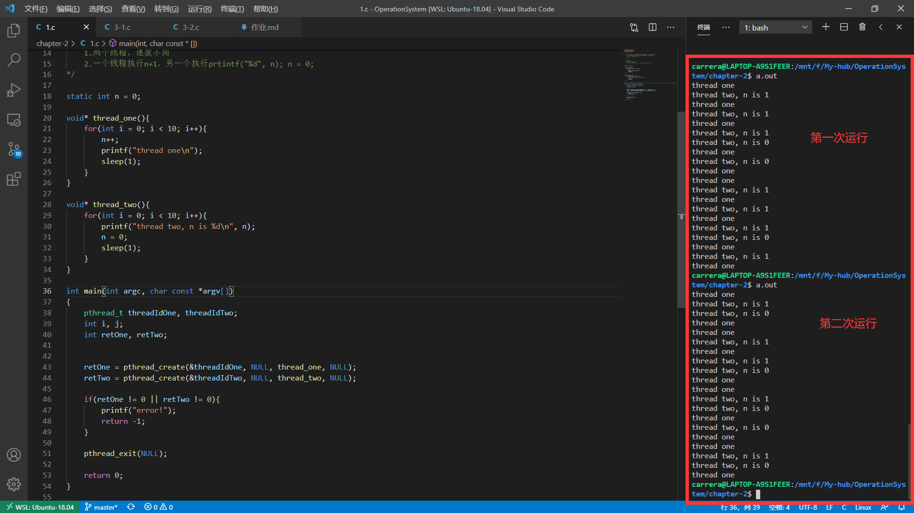

# 第二章-作业1

### 作业要求：
在Linux环境中编写C程序，使得：
1. 两个线程，速度不同
2. 一个线程执行n+1，另一个执行prtintf("%d", n); n = 0;

#### 运行结果

#### 代码
```c
#include <stdio.h>
#include <pthread.h>
#include <unistd.h>

/*
    pthread库不是Linux系统默认的库，连接时需要使用库libpthread.a, 
    在使用pthread_create创建线程时，在编译中要加-lpthread参数:
    >> gcc 1.c -lpthread -o ct
    >> ./ct
*/
static int n = 0;

void* thread_one(){
    for(int i = 0; i < 10; i++){
        n++;
        printf("thread one\n");
        sleep(1);
    }
}

void* thread_two(){
    for(int i = 0; i < 10; i++){
        printf("thread two, n is %d\n", n);
        n = 0;
        sleep(1);
    }
}

int main(int argc, char const *argv[])
{
    pthread_t threadIdOne, threadIdTwo;
    int i, j;
    int retOne, retTwo;

    
    retOne = pthread_create(&threadIdOne, NULL, thread_one, NULL);
    retTwo = pthread_create(&threadIdTwo, NULL, thread_two, NULL);

    if(retOne != 0 || retTwo != 0){
        printf("error!");
        return -1;
    }
    
    pthread_exit(NULL);
    
    return 0;
}
```

### 总结
**使用pthread_creat来创建**

<!-- - 1.c为成功样例，1-2.c 和 1-3.c来自网络，但是并没有达到实验预期 -->