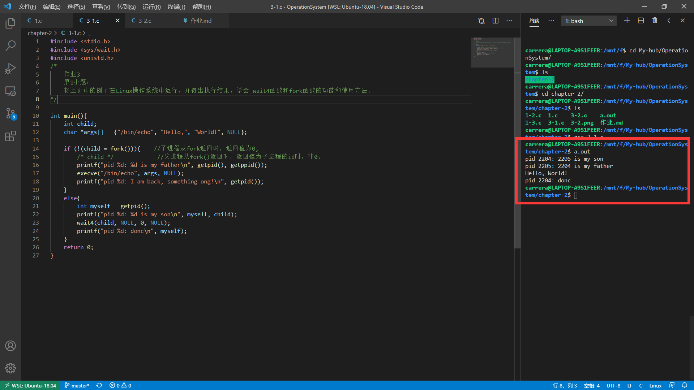

# 第二章-作业1

### 作业要求：
在Linux环境中编写C程序，使得：
1. 两个线程，速度不同
2. 一个线程执行n+1，另一个执行prtintf("%d", n); n = 0;

#### 运行结果

#### 代码
```c
#include <stdio.h>
#include <pthread.h>
#include <unistd.h>

/*
    pthread库不是Linux系统默认的库，连接时需要使用库libpthread.a, 
    在使用pthread_create创建线程时，在编译中要加-lpthread参数:
    >> gcc 1.c -lpthread -o ct
    >> ./ct
*/
static int n = 0;

void* thread_one(){
    for(int i = 0; i < 10; i++){
        n++;
        printf("thread one\n");
        sleep(1);
    }
}

void* thread_two(){
    for(int i = 0; i < 10; i++){
        printf("thread two, n is %d\n", n);
        n = 0;
        sleep(1);
    }
}

int main(int argc, char const *argv[])
{
    pthread_t threadIdOne, threadIdTwo;
    int i, j;
    int retOne, retTwo;

    
    retOne = pthread_create(&threadIdOne, NULL, thread_one, NULL);
    retTwo = pthread_create(&threadIdTwo, NULL, thread_two, NULL);

    if(retOne != 0 || retTwo != 0){
        printf("error!");
        return -1;
    }
    
    pthread_exit(NULL);
    
    return 0;
}
```

### 总结
**使用pthread_creat来创建**

<!-- - 1.c为成功样例，1-2.c 和 1-3.c来自网络，但是并没有达到实验预期 -->

# 第二章-作业3
## 作业要求：
### 1. 将[这个例子](./1.c)在Linux操作系统中运行，并得出执行结果，学会 wait4函数和fork函数的功能和使用方法
#### 运行结果

#### 代码如下
```c
#include <stdio.h>
#include <sys/wait.h>
#include <unistd.h>
int main(){
    int child;
    char *args[] = {"/bin/echo", "Hello", "World!", NULL};
        
    if (!(child = fork())){ //子进程从fork返回时，返回值为0;
        /* child */         //父进程从fork()返回时，返回值为子进程的id时，非0。
        printf("pid %d: %d is my father\n", getpid(), getppid());
        execve("/bin/echo", args, NULL);
        printf("pid %d: I am back, something ong!\n", getpid());
    }
    else{
        int myself = getpid();
        printf("pid %d: %d is my son\n", myself, child);
        wait4(child, NULL, 0, NULL);
        printf("pid %d: donc\n", myself);
    }
    return 0;
}
```

### 2. 学习 Linux系统调用wait3，wait4，waitpid 的功能和使用方法，他们都是指定要等待子进程结束，他们有何区别？编程练习这3个函数的使用。
#### 总结：
- waitpid:如果在调用waitpid()时子进程已经结束,则 waitpid()会立即返回子进程结束状态值。 子进程的结束状态值会由参数 status 返回,而子进程的进程识别码也会一起返回。如果不在意结束状态值,则
参数 status 可以设成 NULL。参数 pid 为欲等待的子进程识别码        
    - 其他数值意义如下:pid<-1 等待进程组识别码为 pid 绝对值的任何子进程。pid=-1 等待任何子进程,相当于 wait()。pid=0 等待进程组识别码与目前进程相同的任何子进程。pid>0 等待任何子进程识别码为 pid 的子进程。
- wait3和wait4函数执行与waitpid类似的工作，主要的语义差别在于，wait3和wait4在参数rusage所指向的结构中返回终止子进程的资源使用情况
- wait3等待所有的子进程；wait4可以像waitpid一样指定要等待的子进程：pid>0表示子进程ID；pid=0表示当前进程组中的子进程；pid=-1表示等待所有子进程；pid<-1表示进程组ID为pid绝对值的子进程。
#### 运行结果

#### 代码如下
```c
#include <stdio.h>
#include <stdlib.h>
#include <unistd.h>
#include <sys/wait.h>

void my_wait3(){
    int child;
    char *args[] = {"/bin/echo", "Hello,", "wait3() !", NULL};
        
    if (!(child = fork())){    
        printf("pid %d: %d is my father\n", getpid(), getppid());
        // execve("/bin/echo", args, NULL);
        // printf("pid %d: I am back, something ong!\n", getpid());
    }
    else{
        int myself = getpid();
        printf("pid %d: %d is my son\n", myself, child);
        wait3(NULL, 0, NULL);
        printf("pid %d: donc\n", myself);
    }
    // return 0;
}

void my_wait4(){
    int child;
    char *args[] = {"/bin/echo", "Hello,", "World!", NULL};
        
    if (!(child = fork())){    
        printf("pid %d: %d is my father\n", getpid(), getppid());
        // execve("/bin/echo", args, NULL);
        // printf("pid %d: I am back, something ong!\n", getpid());
    }
    else{
        int myself = getpid();
        printf("pid %d: %d is my son\n", myself, child);
        wait4(child, NULL, 0, NULL);
        printf("pid %d: donc\n", myself);
    }
    // return 0;
}

void my_waitpid(){  //waitpid练习
    pid_t pc, pr;

    pc = fork();
    if(pc < 0 )
    {
            printf("Error fork\n");
            exit(1);
    }
    else if( pc == 0 )    /* 子进程 */
    {
        /* 子进程暂停5s */
        sleep(5);
        /* 子进程正常退出 */
        exit(0);
    }
    else    /* 父进程 */
    {
        /* 循环测试子进程是否退出 */
        do
        {
            /* 调用waitpid，且父进程不阻塞 */
            pr = waitpid(pc, NULL, WNOHANG);

            /* 若子进程还未退出，则父进程暂停1s */
            if( pr == 0 )
            {
                printf("The child process has not exited\n");
                sleep(1);
            }
        }while( pr == 0 );

        /* 若发现子进程退出，打印出相应情况 */
        if( pr == pc )
        {
            printf("Get child exit code: %d\n",pr);
        }
        else
        {
            printf("Some error occured.\n");
        }
    }
}

int main(int argc, char const *argv[])
{
    printf("practice function: wait3()\n");
    my_wait3();
    puts("");
    printf("practice function: wait4()\n");
    my_wait4();
    puts("");
    printf("practice function: pidwait()\n");
    my_waitpid();
    return 0;
}
```